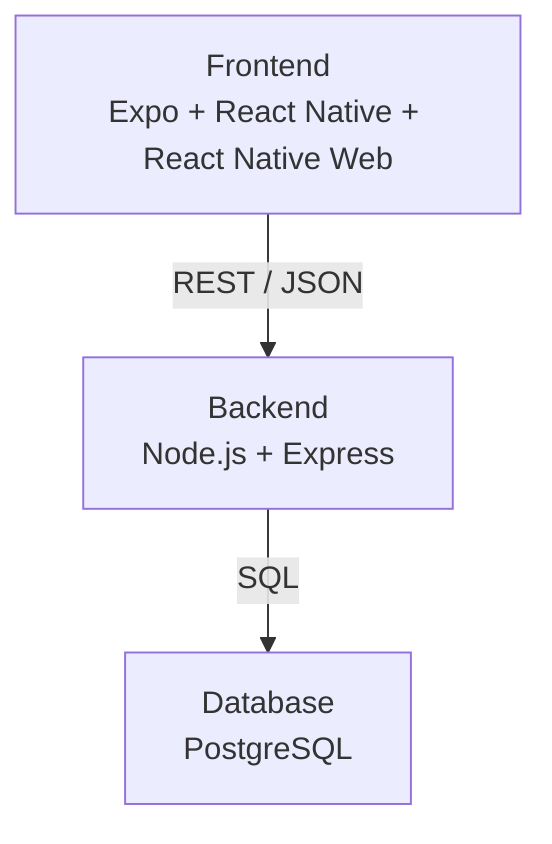

# Auxion | Full-Stack Auction Platform

> A mobile-first auction platform built with Expo, React Native, Node.js, Express and PostgreSQL.

> This portfolio version was prepared as part of my project submission for Tienda Pago's Technology Internship. It is an independent technical project and not an official Tienda Pago product.

## 1. Project Overview

Auxion is an auction application where users can register, authenticate, manage their profile and payment methods, browse auctions, enter live auction rooms, place bids, review activity, and publish items for auction review.

The project demonstrates a complete flow from frontend interaction to backend business rules and PostgreSQL persistence.

## 2. What This Project Demonstrates

### Frontend + Backend

Frontend:

- Expo.
- React Native.
- React Native Web.
- JavaScript.
- Reusable components and screens.
- State and user interaction.
- REST API consumption.
- Mobile-first design.
- Browser execution through React Native Web.

Backend:

- Node.js 20.
- Express 5.
- REST API.
- JWT authentication.
- bcrypt password hashing.
- Authorization for protected and back-office operations.
- Validation and consistent error handling.

React Native uses the React component model to build native-oriented screens. React Native Web allows this portfolio version to be evaluated through a browser without presenting it as identical to a traditional React web app.

Request flow:

```text
React Native / Expo Web
-> HTTP REST request
-> Node.js / Express
-> PostgreSQL
-> JSON response
-> frontend update
```

### Database

Auxion uses PostgreSQL 16 with relational data modeling for users, auctions, lots, bids, payments, activity, and article publication.

The database includes primary keys, foreign keys, constraints, indexes, migrations, and a reproducible demo seed. Monetary values use PostgreSQL `NUMERIC(15,2)`. Bid creation runs inside transactions, and concurrent bids are protected with PostgreSQL row-level locking through `FOR UPDATE`.

The local database can be created from scratch and does not depend on a copy of a private cloud database.

### AI-Assisted Development

AI was used as an engineering assistant during the portfolio-improvement stage:

- ChatGPT, using GPT-5.6 Pro with Very High / Pro reasoning effort, was used for repository analysis, project selection, architecture review, improvement planning, iterative review, and conversion of Santino's informal requirements into structured Codex prompts.
- OpenAI Codex, using GPT-5.5 with Extra High reasoning effort, was used to implement the approved changes.
- Santino reviewed the code and reports, manually validated Docker, PostgreSQL, the backend, and Expo Web, and tested the principal flows.
- GitHub Actions provided an additional automated verification layer.
- Automated tests and CI complemented manual review; they did not replace it.

More detail is available in [docs/AI_ASSISTED_DEVELOPMENT.md](docs/AI_ASSISTED_DEVELOPMENT.md).

## 3. Main Features

- Authentication.
- Password recovery.
- Profile management.
- Payment methods.
- Auction list and details.
- Access validation.
- Live auction room.
- Bidding.
- Activity/history.
- Article publication.
- Back-office validation where applicable.

## 4. Architecture And Tech Stack



Docker Compose starts:

- The Node.js/Express API container.
- The PostgreSQL container.

The frontend runs separately through Expo Web or Expo.

| Layer | Technology |
| --- | --- |
| Frontend | Expo 54, React Native, React Native Web, JavaScript |
| Backend | Node.js 20, Express 5 |
| API | REST, JSON, JWT authentication |
| Database | PostgreSQL 16, `pg`, SQL migrations |
| Security | bcrypt password hashing, CORS allowlist, protected back-office routes |
| Local environment | Docker Compose for API and PostgreSQL |
| Testing | `node:test`, `node:assert`, `supertest`, GitHub Actions |

## 5. Local Reproducible Environment

The original academic environment depended on cloud infrastructure that was not controlled by Santino. This portfolio version was made independent from that infrastructure.

Docker Compose provides a reproducible local backend and PostgreSQL environment. Migrations create the schema, and the seed creates fictitious demo data. No Railway or Supabase access is required to run the validated local version.

## 6. Technical Challenge: Concurrent Bidding

A live auction can receive bids from two users at nearly the same time. Without synchronization, both requests could read the same previous highest bid and make decisions from stale data.

The backend handles this by creating each bid inside a PostgreSQL transaction. The current lot row is locked with `FOR UPDATE`, then the critical business rules are revalidated after the lock is acquired. The bid, payment association, and activity/message record are committed atomically. If any step fails, the transaction rolls back.

An integration test executes concurrent HTTP bid requests and verifies final database consistency.

## 7. Testing And Continuous Integration

Final validated results:

- 15 unit tests passed.
- 10 integration tests passed.
- 25 total backend tests passed.
- 0 failed.
- 0 skipped.
- Concurrent bidding test passed.
- Expo Web export passed.
- GitHub Actions passed.

Unit tests cover isolated business and utility logic. Integration tests cover API behavior, authentication, PostgreSQL-backed flows, and bidding behavior.

GitHub Actions runs the configured validation pipeline automatically with Node.js 20 and a PostgreSQL 16 service. Manual smoke testing was also completed.

Full validation details are available in [docs/VALIDATION.md](docs/VALIDATION.md).

## 8. Local Setup

1. Clone the repository.

```bash
git clone https://github.com/SantinoBertoia/auxion-fullstack-auction-platform.git
cd auxion-fullstack-auction-platform
```

2. Copy the environment examples.

```bash
cp .env.example .env
cp backend/.env.example backend/.env
```

3. Start Docker Desktop.

4. Start the local API and PostgreSQL containers.

```bash
npm run local:up
```

5. Run database migrations.

```bash
docker compose exec api npm run db:migrate
```

6. Load demo data.

```bash
docker compose exec api npm run db:seed
```

7. Verify the API health endpoint.

```bash
curl http://localhost:3000/api/health
```

Expected response:

```json
{"ok":true,"database":"connected","message":"Auxion API is healthy"}
```

8. Install frontend dependencies.

```bash
npm ci
```

9. Start Expo Web.

```bash
npm run web
```

The API runs on `localhost:3000`. PostgreSQL runs locally through Docker. Expo Web normally runs on `localhost:8081`.

To stop the containers:

```bash
docker compose down
```

Data remains in the Docker volume unless volumes are explicitly removed.

## 9. Demo Users And Suggested Flow

All demo users use password `123456`.

| Email | Purpose |
| --- | --- |
| `juan@email.com` | Main happy-path bidder with a verified USD payment method |
| `ana@email.com` | Second bidder for competition and concurrent bidding demos |
| `mira@email.com` | Can enter auctions but cannot bid because payment is not verified |
| `carlos@email.com` | Rejected from bidding because of insufficient category |
| `elena@email.com` | Not admitted yet |
| `bruno@email.com` | Disabled account |
| `backoffice@auxion.local` | Employee account for back-office endpoints |

Suggested demo flow:

1. Log in as `juan@email.com`.
2. Browse auctions.
3. Enter the live auction.
4. Place a valid bid.
5. Attempt an invalid or duplicate-leading bid.
6. Log in as `ana@email.com`.
7. Submit a higher bid.
8. Review activity/history.
9. Open article publication.

## 10. Project Origin And Individual Continuation

Auxion was originally developed as a team project for a university course.

Santino later selected it as the basis for this portfolio version because it was the most complete and relevant project among his existing work for the Tienda Pago activity.

This public repository contains the independently continued portfolio version of the original academic project. The individual continuation focused on local reproducibility, Docker, PostgreSQL, configuration, security, transaction consistency, automated testing, CI, and technical documentation.

## 11. Known Limitations

- Auxion is a portfolio and educational project, not a production auction or payment platform.
- Payment data and operations are simulated with fictitious demo information.
- The frontend remains mobile-first even though it can run through React Native Web.
- Remaining frontend dependency-audit findings belong mainly to the Expo/Metro chain and were not force-upgraded to avoid breaking the validated project.
- Back-office operations exist as API endpoints, not as a complete admin UI.

## API Documentation

A Postman collection is available at [docs/postman/Auxion.postman_collection.json](docs/postman/Auxion.postman_collection.json).

Import it into Postman, keep `baseUrl` as `http://localhost:3000/api`, run login first, and the collection will store the JWT in `{{token}}`.

Back-office endpoints use `backoffice@auxion.local` with password `123456` and the same bearer-token mechanism as the rest of the API.
